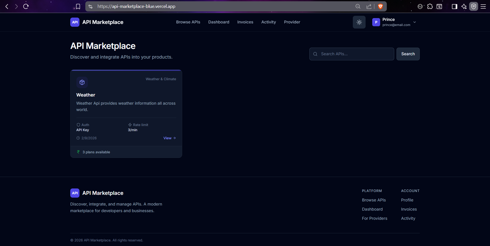

# API Marketplace


Full-stack API marketplace where providers publish and monetize APIs, consumers discover and subscribe to them, and all requests flow through a rate-limited gateway. Built with TypeScript (Express + Next.js).

## Tech Stack

**Backend:** Node.js, Express, TypeScript, PostgreSQL, Prisma, Redis, BullMQ, JWT, Razorpay, Zod
**Frontend:** Next.js 15 (App Router), React, TypeScript, Tailwind CSS, Firebase Auth
**Infra:** Docker Compose, Nginx, PostgreSQL, Redis

## Prerequisites

- Node.js >= 18, PostgreSQL >= 14, Redis >= 7
- Razorpay test account (payments)
- Firebase project (optional, Google OAuth)

## Quick Start

```bash
# Clone & install
git clone <repository-url> && cd api-marketplace
cd backend && npm install
cd ../frontend && npm install

# Backend setup
cd ../backend
cp .env.example .env   # Edit with your DB, Redis, JWT, Razorpay credentials
npx prisma generate && npx prisma migrate dev && npx prisma db seed

# Frontend setup
cd ../frontend
cp .env.example .env   # Edit with Firebase credentials (optional)

# Run (two terminals)
cd backend && npm run dev     # port 4000
cd frontend && npm run dev    # port 5173
```

## Key Environment Variables

**Backend** (`backend/.env`):
- `DATABASE_URL` - PostgreSQL connection string
- `REDIS_URL` - Redis connection string
- `JWT_ACCESS_SECRET` / `JWT_REFRESH_SECRET` - token signing keys
- `RAZORPAY_TEST_KEY_ID` / `RAZORPAY_TEST_KEY_SECRET` - payment keys
- `CORS_ORIGIN` - frontend URL (default: `http://localhost:5173`)

**Frontend** (`frontend/.env`):
- `NEXT_PUBLIC_FIREBASE_*` - Firebase config for Google OAuth

## Scripts

```bash
# Backend
npm run dev              # Dev server with hot reload
npm run build            # Compile TypeScript
npm run prisma:migrate   # Create migration
npm run prisma:studio    # Browse DB in browser

# Frontend
npm run dev              # Dev server (port 5173)
npm run build            # Production build
```
